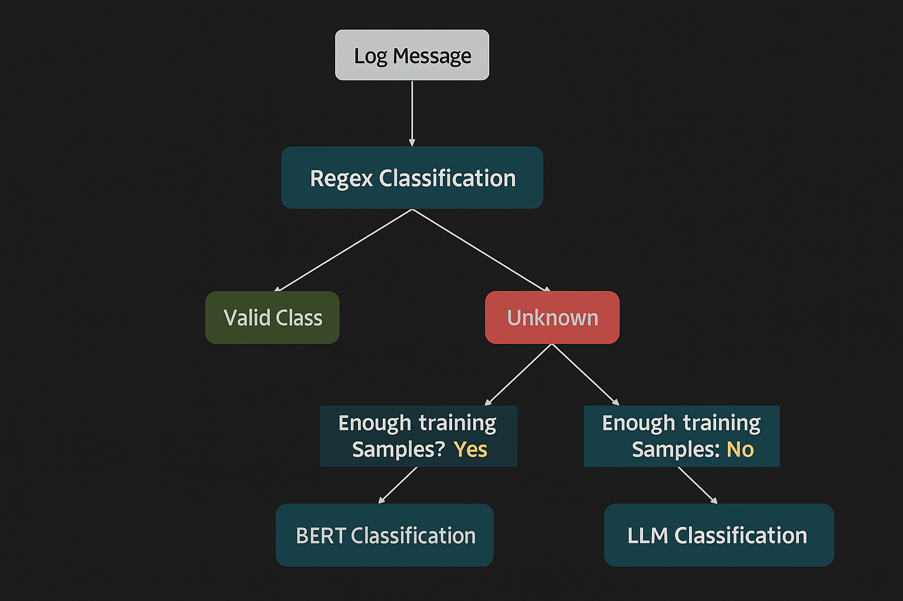

# 📌 Log Classification with a Hybrid Framework  

This project implements a **hybrid log classification system** that combines three complementary approaches to handle different types of log patterns.  
The framework ensures flexibility and robustness in processing predictable, complex, and poorly-labeled log data.

---

## 🔍 Core Classification Approaches  

1. **Regular Expression (Regex)**  
   - For simple, highly predictable patterns.  
   - Captures log formats that can be matched via predefined rules.  

2. **Sentence Transformer + Logistic Regression**  
   - For complex patterns when sufficient labeled training data exists.  
   - Uses **Sentence Transformers** for embeddings and applies **Logistic Regression** for classification.  

3. **LLM (Large Language Model) Inference**  
   - For patterns with limited labeled data.  
   - Acts as a fallback or complementary classifier using a prompt-based approach.  



---

## 📂 Folder Structure  

```
project/
│
├── __pycache__/                 # Python cache files
│
├── classify.py                  # Script for running classification
├── main.py                      # Main execution script
├── processor_bert.py            # BERT-based classification module
├── processor_llm.py             # LLM-based classification module
├── processor_regex.py           # Regex-based classification module
├── requirements.txt             # Python dependencies
├── README.md                    # Project documentation
│
├── models/                      # Saved model files
│   └── log_classifier.joblib    # Trained classifier model
│
├── resources/                   # Data and image resources
│   ├── output.csv                # Sample output from classifier
│   ├── test.csv                  # Test dataset
│
├── training/                    # Training scripts and datasets
│   ├── training.ipynb            # Jupyter notebook for training
│   └── dataset/                  # Training datasets
│       └── synthetic_logs.csv
│
└──
```

---

## ⚙ Setup Instructions  

1. **Clone the repository**  
   ```bash
   git clone https://github.com/Fakiha-soha/Project_ClassificationLogs.git
   cd log-classification-hybrid
   ```

2. **Install dependencies**  
   ```bash
   pip install -r requirements.txt
   ```

3. **Run the training script**  
   - **Regex Classifier**  
     ```bash
     python training/regex_classifier.py
     ```
   - **Sentence Transformer + Logistic Regression**  
     ```bash
     python training/st_logistic.py
     ```

4. **Test with sample data**  
   ```bash
   python test_model.py --input resources/test.csv --output resources/output.csv
   ```

---

## 📊 Example Output  

| source   | log_message                          | target_label   |
|----------|--------------------------------------|----------------|
| app.log  | User login successful                | Authentication |
| sys.log  | Disk space below threshold           | Warning        |
| app.log  | Failed to connect to database        | DatabaseError  |

---

## 🚀 Features  

✅ Handles **simple to highly complex** log messages  
✅ Works with **limited or abundant training data**  
✅ Supports **hybrid decision-making** between Regex, ML, and LLM  
✅ Easily extendable to new log categories  

---

## 📌 Next Steps / Future Work  

- [ ] Add **FastAPI backend** for API-based classification  
- [ ] Integrate **real-time log streaming**  
- [ ] Experiment with **few-shot learning** for LLM classification  

---
